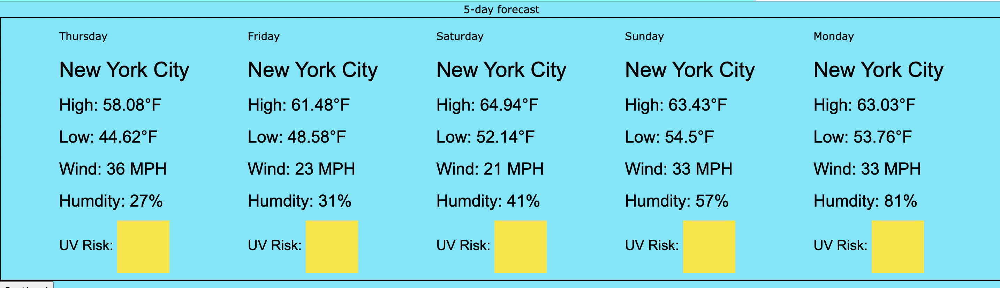

# Weather App

[Deployed Site]()

## Description
This weather app uses the OpenWeather API. When you search for a city, it checks for the longitude and latitude and displays the current weather as well as the 5-day forecast. It will then store your recently searched cities in a series of buttons on the bottom to quickly re-check the weather.

### Screenshot

